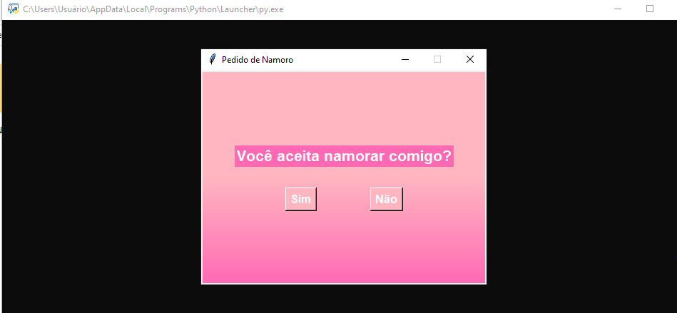

<h1 align="center"> Quer namorar comigo?? </h1>

Pedido de namoro em linguagem Python!

  <a href="#-tecnologias">Tecnologias</a>&nbsp;&nbsp;&nbsp;|&nbsp;&nbsp;&nbsp;
  <a href="#-projeto">Projeto</a>&nbsp;&nbsp;&nbsp;|&nbsp;&nbsp;&nbsp;

 

  

## 🚀 Tecnologias

Esse projeto foi desenvolvido com as seguintes tecnologias:

- Pyhton

## 💻 Projeto

Um simples pedido de namoro diferente feito na linguagem de programação Python

---

Feito por Guilherme Lins Oliveira.
